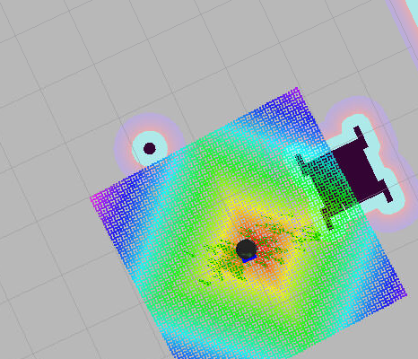

# ROBOND Home Service Robot

This project is part of the Udacity Robotics Nanodegree program. In this project, I used a world file developed earlier in the Nanodegree. Then a turtlebot was deployed in the environment by linking the world to it. 

## Packages Used
The following packages were instaled:
```
git clone https://github.com/ros-perception/slam_gmapping.git
git clone https://github.com/turtlebot/turtlebot.git
git clone https://github.com/turtlebot/turtlebot_interactions.git
git clone https://github.com/turtlebot/turtlebot_simulator.git
```

## Shell Scripts
Then the following shell scripts were created (kept in /src/shellscripts): <br/>
**test_slam.sh**: To launch turtlebot in myworld and observe map in rviz. Also, the bot could be navigated with keyboard using teleop package.<br/>
**test_navigation.sh**: To launch turtlebot in myworld and observe bot localize using standard amcl ros pacakage in rviz.<br/>
**pick_objects.sh**: To provide multiple goals top the bot and see the bot navigate to those points in rviz.<br/>
**add_markers**: To place a cube shaped virtual object at the "pickup" location, wait for 5 seconds and then move the object to "dropoff" location.<br/>
**home_service.sh**: To combine all the actions decribed above. The bot is launched in myworld in gazebo. Also the pick_objects and add_markers nodes are launched. A virtual object is placed at the "pickup location. After the bot arrives at the location, the marker dissapears. Finally, when the bot arrives at the dropoff location, the marker re-appears at  dropoff location. See the out put in images below.<br/>


**Before PickUp (Red Cube at PickUp Location)**


**After PickUp (Object disappears)**


**After DropOff (Object appears in Blue colour)**

